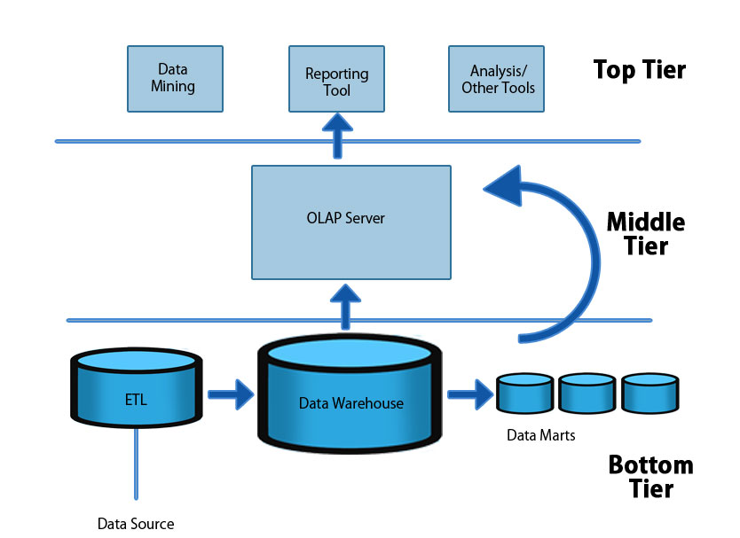
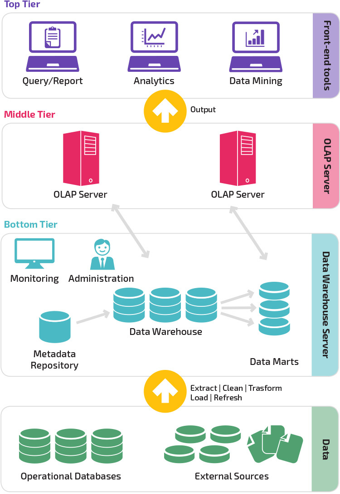

# DW(Data Warehouse)

- 사용자의 의사 결정에 도움을 주기 위하여, 데이터베이스에 축적된 데이터를 공통의 형식으로 변환해서 관리하는 데이터베이스를 말한다.
- 데이터 웨어하우스는 방대한 조직 내에서 분산 운영되는 각각의 데이터 베이스 관리 시스템들을 효율적으로 통합하여 조정, 관리하기 때문에 효율적인 의사 결정 시스템을 위한 기초를 제공하는 실무적인 활용 방법론이다.
- 데이터 웨어하우스는 경영자의 의사 결정을 지원하는 데이터의 집합체로 주제 지향적(subjectoriented), 통합적(integrated), 시계열적(timevarient), 비휘발적(nonvolatile)인 네 가지 특성을 지닌다.
- 업 활동 전반에 필요한 모든 정보를 일원화해 관리하며, 원시 데이터 계층, 데이터 웨어하우스 계층, 클라이언트 계층으로 구성되어 데이터의 추출, 저장, 조회 등의 기능을 수행한다.
- 병렬 서버의 등장과 자기 디스크 장치의 대용량화•저가격화로 인해 가능하게 되었다.

- 병렬 서버를 사용하면 하나의 검색 처리 요구를 분할하여 복수 프로세스로 병렬 처리함으로써 고속으로 검색할 수 있기 때문이다.

## Architecture

- 데이터 웨어하우스 아키텍처는 3개의 티어로 구성됩니다. 

[출처: https://headlinecode.com/data-warehouse-development-practices-to-be-followed/]

- 하단 티어는 데이터가 로드되고 저장되는 데이터베이스 서버
- 중간 티어는 데이터를 액세스하고 분석하는 데 사용되는 분석 엔진
- 상단 티어는 보고, 분석 및 데이터 마이닝 도구를 통해 결과를 제시하는 프런트 엔드 클라이언트

## Data Warehouse 동작

- 데이터 웨어하우스는 데이터를 정수, 데이터 필드 또는 문자열과 같은 레이아웃 및 유형을 설명하는 스키마로 구성함으로써 작동합니다. 
- 데이터가 수집되면 스키마에 의해 설명되는 다양한 테이블에 저장됩니다. 
- 쿼리 도구는 스키마를 사용하여 어떤 데이터 테이블을 액세스하고 분석할지 결정합니다.

## Data Warehouse VS Database

- 데이터 웨어하우스는 데이터 분석을 위해 특별히 설계되었으며, 여기에는 대량의 데이터를 읽어 데어터 전반에 걸친 관계와 추세를 파악하는 작업이 포함됩니다.
- 데이터베이스는 트랜잭션의 세부 사항을 기록하는 것과 같이 데이터를 캡처하고 저장하는 데 사용됩니다.

| **특징**        | **DW**                                                 | **DB**                  |
| --------------- | :----------------------------------------------------- | :---------------------- |
| 적합한 워크로드 | 분석, 보고, 빅데이터                                   | 트랜잭션 처리           |
| 데이터 액세스   | I/O를 최소화하고 데이터 처리량을 최대화하도록 최적화됨 | 대량의 소규모 읽기 작업 |

## Data Warehouse VS Data Lake

- 데이터 웨어하우스와 달리, 데이터 레이크는 정형 및 비정형 데이터를 비롯한 모든 데이터에 대한 중앙 리포지토리입니다. 
- 데이터 웨어하우스는 분석에 최적화된 사전 정의된 스키마를 사용합니다. 
- 데이터 레이크에서는 스키마가 정의되지 않아 대형 데이터 분석, 전체 텍스트 검색, 실시간 분석 및 기계 학습과 같은 추가 유형의 분석이 가능합니다.

## Data Warehouse VS Data Mart

- 데이터 마트는 금융, 마케팅 또는 영업과 같은 특정 팀 또는 사업 단위의 요구를 충족시키는 데이터 웨어하우스입니다. 
- 규모가 더 작고, 집중적이며 사용자 커뮤니티에 가장 잘 맞는 데이터 요약을 포함할 수 있습니다.

[출처: https://loustler.io/data_eng/diff-data_lake-data_warehouse/]

# References

- [https://ko.wikipedia.org/wiki/%EB%8D%B0%EC%9D%B4%ED%84%B0_%EC%9B%A8%EC%96%B4%ED%95%98%EC%9A%B0%EC%8A%A4](https://ko.wikipedia.org/wiki/데이터_웨어하우스)

- https://digitalbourgeois.tistory.com/71
- https://aws.amazon.com/ko/data-warehouse/